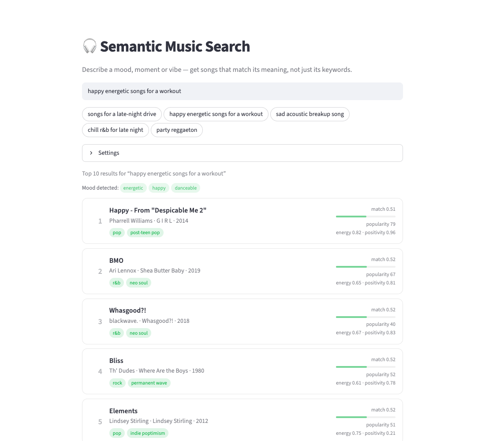
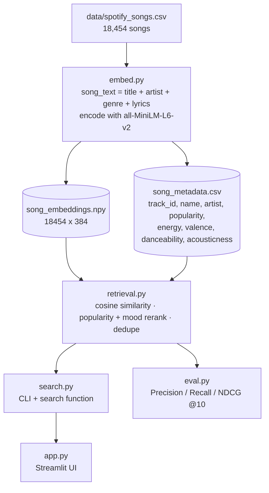

# 🎧 Semantic Music Search

Search ~18.5k Spotify songs by describing what you want to hear — *"songs for a
late-night drive"*, *"sad acoustic breakup song"*, *"party reggaeton"* — instead
of typing exact titles or artists.

Each song's title, artist, genre and lyrics are encoded into a sentence
embedding; a query is embedded the same way and matched by cosine similarity.
The best matches are then re-ranked using popularity and — when the query
mentions a mood like *calm*, *sad* or *workout* — the songs' measured audio
features (energy, valence, danceability, acousticness). It ships with a
Streamlit UI, a CLI, and an offline evaluation script.

<picture>
  <source media="(prefers-color-scheme: dark)" srcset="docs/screenshot-dark.png">
  
</picture>

## Features

- **Natural-language search** — describe a mood, activity, theme or genre in plain English.
- **Semantic retrieval** — query and songs are embedded with `all-MiniLM-L6-v2`; results are ranked by cosine similarity (top 10 by default).
- **Hybrid ranking** — optionally blends semantic similarity with Spotify popularity (`alpha` controls the mix).
- **Mood-aware ranking** — mood words in the query (e.g. *calm*, *chill*, *sad*, *happy*, *workout*, *dance*, *acoustic*) are matched against each song's audio features, so "calm music" favours songs that actually measure as low-energy — not just songs whose lyrics say "calm".
- **Duplicate collapsing** — the same song released on several albums appears only once in results.
- **Streamlit UI** — search box, example queries, the detected mood, adjustable result count / ranking, and result cards with album, year, genre tags, energy/positivity and a link to the track on Spotify. Follows your light/dark preference. Searches are shareable via `?q=...` in the URL.
- **CLI** — `python search.py "your query"` with `--top-k`, `--alpha`, `--mood-weight`, `--no-hybrid`.
- **Offline evaluation** — Precision@10 / Recall@10 / NDCG@10 over a 10-query weak-labeled set, comparing semantic-only, hybrid, and hybrid + mood ranking.

## Tech stack

Python 3.10+ · [Sentence Transformers](https://www.sbert.net/) (`all-MiniLM-L6-v2`) · NumPy · Pandas · Streamlit · pytest

## Architecture



- **`embed.py`** is a one-time offline step. Row *i* of `song_embeddings.npy` and `song_metadata.csv` refer to the same song.
- **`retrieval.py`** is the shared ranking core, so the CLI, the UI and the evaluation all rank with exactly the same code.
- Search is a **brute-force** dot product over all 18k vectors (milliseconds at this size). There is no approximate-nearest-neighbour index — see [Future improvements](#future-improvements).

### How ranking works

1. Embed the query and compute cosine similarity against every song.
2. **Semantic-only mode (`--no-hybrid`):** sort by similarity.
3. **Hybrid mode (default):** take the top 100 songs by similarity (or `2 × top_k` if more results are requested), then re-rank them by
   `score = alpha × norm_similarity + (1 − alpha) × popularity / 100`,
   where similarity is min-max normalized within that candidate pool. Popularity can only reorder songs that already matched semantically — it never pulls in an unrelated song. `alpha = 0.8` by default (1.0 = pure semantic, 0.0 = pure popularity).
4. **Mood:** if the query contains mood keywords (`retrieval.MOOD_KEYWORDS`), each one sets a target direction on an audio feature — e.g. *sad* → low valence, *workout* → high energy and danceability, *acoustic* → high acousticness. The candidate pool widens to 200 and the score becomes
   `score = (1 − mood_weight) × hybrid_score + mood_weight × mood_fit`,
   where `mood_fit` is the song's average fit to those targets (a feature value for "high", 1 − value for "low"). `mood_weight = 0.3` by default; 0 disables it. Queries without mood words are unaffected.
5. Collapse duplicates (same title + artist, case-insensitive) and return the top *k*.

`alpha` and `mood_weight` were chosen by hand and sanity-checked on queries outside the evaluation set — not tuned to maximize the evaluation (see [Evaluation](#evaluation) for why that would be circular).

Cosine similarity is used rather than a raw dot product because the model encodes meaning in the *direction* of a vector; normalizing removes any effect of text length on magnitude.

## Prerequisites

- Python 3.10 or newer (tested on 3.10 and 3.13)
- ~2 GB free disk space for dependencies (PyTorch) and ~110 MB for the data + index
- The dataset: **[Audio features and lyrics of Spotify songs](https://www.kaggle.com/datasets/imuhammad/audio-features-and-lyrics-of-spotify-songs)** by Muhammad Nakhaee (Kaggle, free account required). It is not included in this repo: it contains copyrighted lyrics and its license is listed as "Unknown".

## Installation

```bash
# 1. Clone
git clone https://github.com/sanjanaj1712/music-semantic-search.git
cd music-semantic-search

# 2. Create a virtual environment and install dependencies
python3 -m venv .venv
source .venv/bin/activate          # Windows: .venv\Scripts\activate
pip install -r requirements.txt

# 3. Add the dataset
#    Download the Kaggle dataset above and place spotify_songs.csv at:
#    data/spotify_songs.csv
mkdir -p data
mv ~/Downloads/spotify_songs.csv data/   # adjust to wherever you saved it

# 4. Build the search index (one-time, ~2 minutes on a laptop CPU)
python embed.py
```

Step 4 downloads the embedding model (~90 MB) on first run and writes
`song_embeddings.npy` and `song_metadata.csv` to the project root.

## Environment variables

No environment variables are required. See [`.env.example`](.env.example):

| Variable   | Required | Purpose |
|------------|----------|---------|
| `HF_TOKEN` | No       | Hugging Face token. Only raises rate limits for the one-time model download and silences the "unauthenticated requests" warning. Set it in your shell (`export HF_TOKEN=...`); the code does not read `.env` files. |

## Running

**Web UI**

```bash
streamlit run app.py
```

Then open http://localhost:8501. Type a query or click an example; open
**Settings** to change the number of results, turn popularity boosting or mood
matching on/off, or adjust their weights.

**CLI**

```bash
python search.py "songs for a late-night drive"
python search.py "aggressive rap with heavy bass" --top-k 5 --alpha 0.6
python search.py "sad songs about missing someone" --mood-weight 0.5
python search.py "classic rock anthem" --no-hybrid
```

**Evaluation**

```bash
python eval.py
```

**Tests**

```bash
pytest
```

The suite has 38 tests: unit tests for ranking, mood detection, deduplication
and input validation (synthetic data, no model needed), CLI error handling,
and end-to-end tests that run real searches and render the Streamlit app
headlessly. The end-to-end tests are skipped automatically if you haven't run
`embed.py` yet.

## Usage example

```
$ python search.py "sad songs about missing someone" --top-k 5

Top 5 results for "sad songs about missing someone" (hybrid, alpha=0.8; mood: low valence, weight=0.3)

 1. Missing You — Brandy (sim=0.588, pop=40, score=0.877)
 2. Missing You — John Waite (sim=0.561, pop=69, score=0.682)
 3. Winter's Ballad — Cuco (sim=0.535, pop=0, score=0.654)
 4. Mutiny — Killstation (sim=0.522, pop=34, score=0.617)
 5. SaDa — furino (sim=0.504, pop=54, score=0.612)

$ python search.py "songs for a late-night drive"

Top 10 results for "songs for a late-night drive" (hybrid, alpha=0.8)

 1. Midnight City — M83 (sim=0.540, pop=74, score=0.859)
 2. Drive (feat. Ezra Carey) — Myzica (sim=0.552, pop=23, score=0.846)
 3. drive all night — joan (sim=0.542, pop=50, score=0.825)
 4. Awake — TWO LANES (sim=0.536, pop=42, score=0.766)
 5. Night Drive — Gorgon City (sim=0.527, pop=43, score=0.701)
 ...
```

- `sim` — cosine similarity between query and song
- `pop` — Spotify popularity (0–100)
- `score` — the final ranking score (equals `sim` with `--no-hybrid`)
- `mood:` — the audio-feature targets detected from the query (absent when the query has no mood words)

Invalid input is rejected with a clear message, e.g.
`search.py: error: alpha must be between 0.0 and 1.0`.

## Evaluation

There are no human relevance judgments for this dataset, so `eval.py` uses a
**weak-labeled** set of 10 queries. Each query is paired with a rule over the
catalog's genre and audio-feature columns — e.g. *"aggressive rap with heavy
bass"* counts a song as relevant if `playlist_genre == "rap" AND energy > 0.6
AND speechiness > 0.15` (full rules in `eval.py::relevance_labels`).

Mean over the 10 queries, K = 10:

| Ranking                                | Precision@10 | Recall@10 | NDCG@10 |
|----------------------------------------|:------------:|:---------:|:-------:|
| Semantic only                          | 0.190        | 0.0030    | 0.430   |
| Hybrid (alpha=0.8)                     | 0.180        | 0.0028    | 0.440   |
| Hybrid + mood (alpha=0.8, weight=0.3)  | 0.260        | 0.0043    | 0.491   |

How to read this:

- Treat these numbers as **directional**. The labels are hand-written proxies, and 10 queries is too few to separate semantic-only from hybrid with confidence.
- **The mood gain is optimistic.** The semantic and popularity rankers never see genre or audio features, so they can't match the labels directly. The mood reranker *does* use energy, valence, danceability and acousticness — several of the same columns the labels are built from — and its keyword list was written by the same person as the queries. The gain shows the mechanism works as intended; it is not an independent quality measure. Spot checks on queries outside the eval set (e.g. "sad songs about missing someone") show the same direction of improvement.
- Recall@10 is tiny by construction: many queries have 300–1,400 "relevant" songs.
- Two queries still score 0 with mood ranking: *classic rock anthem* (no mood words, and the text model doesn't distinguish classic rock well) and *calm and dreamy for studying late at night* (the label also requires acoustic, partly instrumental tracks, which are rare among its semantic matches).

## Project structure

```
music-semantic-search/
├── app.py               # Streamlit UI
├── search.py            # CLI + search() used by the UI
├── retrieval.py         # shared core: index loading, similarity, ranking, mood keywords, dedupe
├── embed.py             # builds the embedding index from the dataset
├── eval.py              # offline evaluation (Precision/Recall/NDCG@10)
├── explore.py           # exploratory data-analysis script (not part of the pipeline)
├── tests/
│   └── test_retrieval.py
├── .streamlit/config.toml
├── docs/                # README screenshots (light + dark)
├── data/                # (not tracked) spotify_songs.csv goes here
├── requirements.txt
├── pytest.ini
├── .env.example
└── LICENSE
```

## Future improvements

- **Independent evaluation.** Relevance judgments from people who didn't build the ranker, so `alpha` and `mood_weight` can be tuned without the circularity described above.
- **Learned mood mapping.** Replace the hand-written keyword list with a model that predicts target audio features from any query, including moods it doesn't list (and features like `tempo` and `instrumentalness`).
- **Approximate nearest-neighbour index** (FAISS / HNSW) for catalogs in the millions. Brute force is fine at 18k songs.
- **Stronger or music-aware embedding model.** `all-MiniLM-L6-v2` is small, fast and general-purpose, but it knows nothing about music.
- **Personalization** from user feedback or listening history.

## License

Code is released under the [MIT License](LICENSE). The dataset is not included
and is subject to its own terms on Kaggle.
